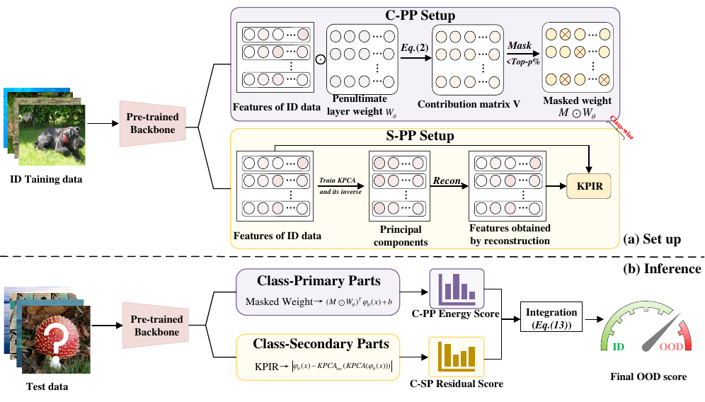

# DFSD Reproduction

This repository provides a clean reproduction package for **Out-of-Distribution Detection with Directed Feature Space Decomposition (DFSD)**. It contains the DFSD scoring code, fixed experiment configs, component ablations, metric computation, and visualization utilities.

The repository intentionally does **not** include large datasets, checkpoints, extracted features, score files, or caches. Put those files under the documented relative paths after downloading them.

## Attribution

This reproduction package uses the same post-hoc OOD evaluation setting as the DICE codebase. The CIFAR data/checkpoint organization, DenseNet checkpoint usage, RouteDICE/DICE model wrapper, and the DICE-based C-PP component are adapted from the official DICE repository:

- DICE GitHub: <https://github.com/deeplearning-wisc/dice>
- DICE paper: *DICE: Leveraging Sparsification for Out-of-Distribution Detection*, ECCV 2022.

Please cite DICE when using the DICE checkpoints or DICE-derived C-PP implementation:

```bibtex
@inproceedings{sun2022dice,
  title={DICE: Leveraging Sparsification for Out-of-Distribution Detection},
  author={Sun, Yiyou and Guo, Chuan and Li, Yixuan},
  booktitle={European Conference on Computer Vision},
  year={2022}
}
```

## Method Summary

DFSD decomposes the feature representation of a fixed classifier into two parts:

```text
DFSD score = C-PP score + C-SP score
C-PP       = logsumexp(logits after contribution-based processing)
C-SP       = max_c -alpha_c * ||z - inverse_c(transform_c(z - u))||
```

The paper setting is `dfsd_main`: C-PP uses the DICE/RouteDICE logits, and C-SP uses class-wise KPCA residuals. The PCA variant `dfsd_main_pca` changes only the C-SP estimator from KPCA to PCA.



## Reproducibility Protocol

### Hyperparameters

| Dataset | Backbone | C-PP `p` | C-SP estimator | KPCA kernel | KPCA/PCA components | Class fitting | Score classes | Scaling factor |
|---|---:|---:|---|---|---:|---|---|---|
| CIFAR-10 | DenseNet | 60 | class-wise KPCA | Gaussian/RBF | `dim=150` | all ID train classes | all classes | class-wise `alpha_c` |
| CIFAR-100 | DenseNet | 90 | class-wise KPCA | Gaussian/RBF | `dim=250` | all ID train classes | all classes | class-wise `alpha_c` |
| ImageNet-1K | ResNet-50 | 60 | class-wise KPCA | Gaussian/RBF | `dim=100` | 100 images/class | class fraction `0.1` | class-wise `alpha_c` |

`dim` follows the paper code convention: the retained KPCA subspace size is computed from the feature dimension and `dim` in `dfsd_repro/dfsd.py`. For ImageNet, `score_class_fraction=0.1` means 10% of ImageNet-1K classes are used for class-wise C-SP scoring; it is not an explained-variance-ratio threshold.

The scaling factor is computed separately for each fitted class:

```text
alpha_c = mean(max training logit) / mean(C-SP training residual for class c)
```

It aligns the C-SP residual scale with the C-PP logit/Energy scale. No OOD samples are used to fit KPCA/PCA, compute `alpha_c`, or calibrate hyperparameters.

### Evaluation Protocol

ID/OOD splits follow the standard post-hoc OOD protocol used by DICE and related work.

| ID dataset | OOD datasets | Backbone/checkpoint | Evaluation split |
|---|---|---|---|
| CIFAR-10 | SVHN, LSUN, LSUN_resize, iSUN, DTD, Places365 | DenseNet checkpoint from DICE-style setup | CIFAR-10 test vs each OOD test set |
| CIFAR-100 | SVHN, LSUN, LSUN_resize, iSUN, DTD, Places365 | DenseNet checkpoint from DICE-style setup | CIFAR-100 test vs each OOD test set |
| ImageNet-1K | iNaturalist, SUN, Places, DTD | torchvision ResNet-50 | ImageNet validation vs each OOD set |

All DFSD variants use the same backbone, feature extractor, ID/OOD splits, and metric implementation. ID samples are treated as positive examples. The operating threshold for FPR95 is set so that 95% of ID samples are accepted.

### Metrics

The reported metrics are standard OOD detection metrics:

- **FPR95**: false positive rate of OOD samples when the true positive rate on ID samples is 95%. Lower is better.
- **AUROC**: area under the ROC curve for separating ID and OOD scores. Higher is better.

The implementation also writes AUIN, AUOUT, and detection error to `metrics.csv`, but paper tables focus on FPR95 and AUROC.

## Repository Layout

```text
dfsd_repro/
  configs/                 # fixed experiment configs
  models/                  # DenseNet/ResNet/RouteDICE model definitions
  utils/                   # dataset, metric, and scoring helpers
  dfsd.py                  # DFSD scoring and PCA/KPCA C-SP variants
  run.py                   # run one config
  run_suite.py             # run CIFAR-10, CIFAR-100, ImageNet configs
  run_ablation.py          # component ablations
  visualize.py             # visualization utilities
  cache/                   # generated locally, ignored by git
  results/                 # generated locally, ignored by git
  figures/                 # generated locally, ignored by git
```

## Environment

```bash
conda env create -f environment.yml
conda activate dfsd
```

All commands below are run from the repository root and use `python -m ...`.

## Data and Checkpoints

Prepare the following local directories. They are ignored by git.

```text
dfsd_repro/checkpoints/
dfsd_repro/id_datasets/
dfsd_repro/ood_datasets/
dfsd_repro/features/          # generated automatically for CIFAR
dfsd_repro/imagenet_feature/  # generated automatically for ImageNet
```

Required CIFAR checkpoints:

```text
dfsd_repro/checkpoints/CIFAR-10/densenet/checkpoint_100.pth.tar
dfsd_repro/checkpoints/CIFAR-100/densenet/checkpoint_100.pth.tar
```

Dataset and checkpoint preparation follows the official DICE repository:
<https://github.com/deeplearning-wisc/dice>

For CIFAR OOD datasets, use the DICE download links and place the extracted
datasets under `dfsd_repro/ood_datasets/`:

- SVHN: <http://ufldl.stanford.edu/housenumbers/>
- DTD: <https://www.robots.ox.ac.uk/~vgg/data/dtd/>
- Places365: <http://data.csail.mit.edu/places/places365/test_256.tar>
- LSUN-C: <https://www.dropbox.com/s/fhtsw1m3qxlwj6h/LSUN.tar.gz>
- LSUN-R: <https://www.dropbox.com/s/moqh2wh8696c3yl/LSUN_resize.tar.gz>
- iSUN: <https://www.dropbox.com/s/ssz7qxfqae0cca5/iSUN.tar.gz>

For ImageNet-1K experiments, prepare ImageNet from the official source and use
the curated large-scale OOD links used by DICE:

- ImageNet-1K: <https://image-net.org/download.php>
- iNaturalist: <http://pages.cs.wisc.edu/~huangrui/imagenet_ood_dataset/iNaturalist.tar.gz>
- SUN: <http://pages.cs.wisc.edu/~huangrui/imagenet_ood_dataset/SUN.tar.gz>
- Places: <http://pages.cs.wisc.edu/~huangrui/imagenet_ood_dataset/Places.tar.gz>
- Textures: <https://www.robots.ox.ac.uk/~vgg/data/dtd/>

## Run Main Experiments

```bash
python -m dfsd_repro.run --config dfsd_repro/configs/cifar10_dfsd.json --modes dfsd_main
python -m dfsd_repro.run --config dfsd_repro/configs/cifar100_dfsd.json --modes dfsd_main
python -m dfsd_repro.run --config dfsd_repro/configs/imagenet_dfsd.json --modes dfsd_main
```

Run all configs:

```bash
python -m dfsd_repro.run_suite
```

Summarize existing scores without recomputing inference:

```bash
python -m dfsd_repro.run --config dfsd_repro/configs/cifar10_dfsd.json --modes dfsd_main --metrics-only
```

Scores, metrics, and caches are written under:

```text
dfsd_repro/results/
dfsd_repro/cache/subspaces/
```

## Ablations

C-PP ablation:

```bash
python -m dfsd_repro.run_ablation --config dfsd_repro/configs/cifar10_dfsd.json
python -m dfsd_repro.run_ablation --config dfsd_repro/configs/cifar100_dfsd.json
```

C-SP variants:

```bash
python -m dfsd_repro.run --config dfsd_repro/configs/cifar10_dfsd.json --modes csp_kpca csp_pca dfsd_main_pca
python -m dfsd_repro.run --config dfsd_repro/configs/imagenet_dfsd.json --modes dfsd_main_pca --pca-components 3
```

## Visualizations

```bash
python -m dfsd_repro.visualize --config dfsd_repro/configs/cifar10_dfsd.json --figure complementarity --out-dataset SVHN
python -m dfsd_repro.visualize --config dfsd_repro/configs/cifar10_dfsd.json --figure tsne_spaces --out-dataset SVHN
python -m dfsd_repro.visualize --figure evr --dataset CIFAR-10 --seed 1
python -m dfsd_repro.visualize --figure bar_line_ablation --spec dfsd_repro/configs/ablation_eta.json
```
